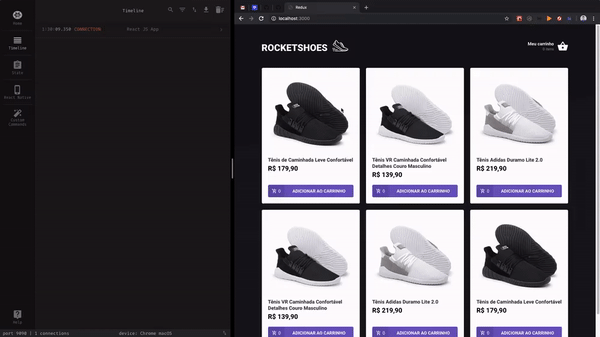

# Instalação

- rode no terminal **yarn** ou **npm install** para instalação das dependencias
- rode o json server na raiz para obter os dados na listagem de produtos

```
json-server api.json -p 3001 -w -d 500
```

Resultado:

<center>

</center>

---
